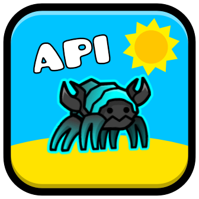

# Xblaze's Geode API
A collection of the most random utilities ever for my Geode mods

## Installation
Add this mod as a dependency on your `mod.json`
```json
"dependencies": {
    "xblazegmd.geode-api": ">=1.0.0"
}
```

Now you can include it like this
```cpp
#include <xblazegmd.geode-api/include/XblazeAPI.hpp>
```

## Utils
### Server Utils
This API adds a bunch of utilities to make working with the GD servers less of a headache

First there's some variables defined that contain data you may find useful
```cpp
// URL to the GD servers (keep in mind it ends with "/")
constexpr std::string_view BOOMLINGS = "http://www.boomlings.com/database/";

// The common secret
constexpr std::string_view SECRET = "Wmfd2893gb7";
```

There's also this nice function to make a request to the GD servers:
```cpp
auto res = co_await xblazeapi::requestGDServers("gjServerEndpoint.php", "request=body");
```

But even this function cannot save you of the pain of having to manually format the absolute mess of a response the GD servers give you... but what abt another function?
```cpp
// key:val:key:val to 'unordered_map'
auto formatted = xblazeapi::formatResponse(res.unwrap());

// Change separator
auto formatted = xblazeapi::formatResponse(res.unwrap(), "~");
```

### Web Utils
Web requests are nice and easy. However there's a lot of stuff you need to write just to make a simple web request. So hopefully these utilities help you with some of the steps
 
First of all there's this nice cross-platform helper function to check if you have internet:
```cpp
auto connected = co_await xblazeapi::doWeHaveInternet();
if (!connected) {
    // do stuff...
}
```

This function will check the internet connection with `GameToolbox::doWeHaveInternet` on mobile, and with a simple web request on PC.

The default URL to make a request to is `http://connectivitycheck.gstatic.com/generate_204`, however you can specify whichever one you wish:
```cpp
auto customURL = co_await xblazeapi::doWeHaveInternet("https://www.google.com"); // Check the connection with Google
```

Building POST request bodies can be a tedious process if you're using `bodyString`. While you could use other methods, if you REALLY need to use `bodyString`, there is a nice helper function to help you make it in a less tedious way:
```cpp
xblazeapi::buildBodyString({
    { "this", "that" },
    { "number", 1 },
    { "subscribe", "toMyYt" }
});
```

### Confirm popups
Have you ever wanted to just have an easier way to make a simple "Yes/No" popup? Sure, `geode::createQuickPopup` is good enough, but what abt a more *convenient* way?
```cpp
// Yes/No
auto res = co_await xblazeapi::confirmYesNo("Title", "Message");

// Confirm/Cancel
auto res = co_await xblazeapi::confirmYesNo("Title", "Message", "Confirm", "Cancel");
```

This function is meant to be called inside a coroutine (thread-safe too!). If you are not inside one, you can use the `confirmYesNoSync` function
```cpp
auto res = xblazeapi::confirmYesNoSync(
    "Title",
    "Message",
    [] {
        // Callback if user clicked "Yes"
    },
    [] {
        // Callback if user clicked "No"
    }
);
```

### Random stuff
```cpp
// Simpler sleep functions
co_await xblazeapi::sleepSecs(10);
co_await xblazeapi::sleepMillis(100);

// Quick error notifications
xblazeapi::quickErrorNotification("Oops!");
xblazeapi::quickErrorNotificationTS("Thread-safe!");

// GEODE_UNWRAP_INTO but for futures
XBLAZE_UNWRAP_INTO_FUTURE(int var, riskyFunction());
```

### Patreon stuff
I'll be honest, the main reason I made this utils mod is so I could have a nice way all of my mods could show some nice badges to my patrons lol

There is *some* utils to get a patron's subscription status on my Patreon, but those are mainly for my mods and not meant for anyone else to use, so I won't document them here

If you have joined my Patreon, you can claim a nice supporter badge by linking your Patreon account [here](https://xblaze.netlify.app/patreon/link)